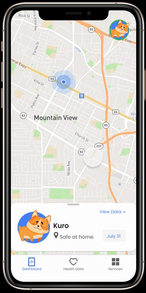

# Kea - Pet Tracking Application
Udacity UX Designer Nanodegree Final Project

Coursework: Fundamentals of UX Design, Neilsen’s Heuristic Evaluation, Quantitative and Qualitative research methodologies, Design psychology behind designing for humans, User research, Wireframing, Usability test, Rapid prototyping, Building Engineering handoff, Information hierarchy, UI design patterns, Visual hierarchy, Grid systems, Typography and Style guides

Tools: Miro, Whimsical, Figma, Zeplin, Lookback, Mobbin, Useberry, Hotjar

- [Prototype Link](https://www.figma.com/proto/fn7K4NfOouOafKMWGQig96/Kea?node-id=291%3A755&scaling=scale-down)

- [Project Link](https://www.figma.com/file/fn7K4NfOouOafKMWGQig96/Kea?node-id=291%3A0)

- [Case Study](https://github.com/anmolraibhandare/Kea/blob/master/Kea%20-%20Case%20Study.pdf)

